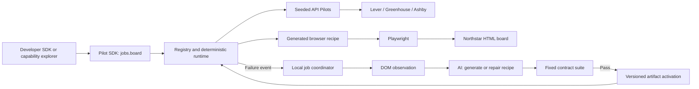

# Pilot developer tool — HackMIT MVP specification

Status: implementation handoff only. No implementation has been started.

This specification replaces the student-portal MVP. It defines a general Pilot developer tool, demonstrated through one concrete capability: **real Lever, Greenhouse, and Ashby boards; a custom job board with no Pilot; live AI generation; then a real break and repair**. The broad compatibility-layer vision in `README.md` remains motivation, not additional scope.

## 1. Outcome and hard scope

Build **Pilot**, a capability SDK, deterministic runtime, terminal package manager, small package registry, AI compiler, and generic capability explorer. The MVP implements one capability, `jobs.board@1`, as its proof case. Three packaged Pilots read real public job listings after installation. A fourth Pilot is generated during the demonstration for **Northstar Jobs**, a controlled fictional board. Changing Northstar's website breaks that implementation; AI produces a tested replacement. The same SDK call and explorer invocation work again without modification.

> Applications target capabilities. AI compiles unfamiliar software into reusable Pilots. Successful searches execute deterministically without model calls.

Real providers use their public job-posting APIs. Northstar exposes HTML pages and is integrated through a generated browser recipe. Supporting these two mechanisms behind the same interface is part of the demonstration. State this distinction openly; do not describe API calls as browser automation.

| Build for this MVP | Do not build |
| --- | --- |
| `jobs.board@1` with **one operation: `search(query)`** | `getJob`, applications, resumes, accounts, saved jobs, alerts |
| Three installable software-level Pilot packages | A bespoke integration per employer |
| Explicit provider targets, with software-instance connections managed by the user | Internet-wide discovery or searching every employer implicitly |
| A second Lever instance to prove driver reuse | Claims that every ATS installation is supported |
| SDK, runtime, terminal Pilot Manager, generic capability explorer, a small HTTP package registry, and compiler | Marketplace accounts, hosted Pilot Cloud, dependency solver |
| Genuine recipe generation and repair for Northstar | Arbitrary-site understanding or production-site auto-repair |
| Deterministic keyword, location, and type filters | Semantic search, model-based ranking, embeddings |
| Publish a generated Pilot and install it in a clean consumer runtime | Arbitrary executable package uploads, publisher reputation, billing |
| Real usage/freshness evidence and honest fallback modes | Invented benchmark savings or scripted progress |

No database service, end-user login, cloud deployment, task broker, multi-agent framework, or sponsor-specific subsystem is required. Codex/Wiggum may implement the project but is not a runtime dependency. The explorer is a developer inspection tool, not a job-search product. Pilot never submits an application.

## 2. Demo acceptance story

Target a five-to-six-minute presentation, with package management and publication included as required steps. Compiler times are rehearsal targets, not guarantees from the model provider.

| Stage | Action | Required visible proof |
| --- | --- | --- |
| Package installation, 20 seconds | `pilot list jobs.search`, `pilot install greenhouse`, then `pilot install jobs` | List distinguishes installed and available targets; category install adds remaining job packages |
| Real interoperability, 45 seconds | Invoke `jobs.board@1/search` with `software engineer intern` in the generic explorer or CLI | Real results from Lever, Greenhouse, and Ashby, original-page links, actual Pilot IDs, zero execution-phase model calls |
| Reusable driver, 15 seconds | Show Palantir and Hermeus bindings | Same `lever/jobs` implementation, different source configuration |
| Missing software, 15 seconds | Include Northstar in the target picker and invoke the same operation | Its target reports `PILOT_NOT_FOUND`; no compatible package exists yet |
| AI compilation, about 75 seconds | Run `pilot create <northstar-url> --name northstar` | Real observations, capability mapping summary, generated artifact, passing tests, registered `northstar/jobs@1.0.0` |
| Same invocation gains support, 15 seconds | Rerun the identical SDK call or generic explorer invocation | Matching synthetic Northstar jobs appear; no code edit or runtime restart |
| Self-healing, about 75 seconds | **Deploy layout B**, then invoke again | Northstar genuinely fails while real sources return data; AI repairs it, tests pass, `1.0.1` becomes active |
| Publish and reuse, about 30 seconds | Publish repaired Northstar, install it in a prepared clean consumer runtime, and invoke | Uploaded package reused by a separate installed state, no model calls; show 1.0.1 and its checksum |

Show a fixed developer SDK snippet alongside the generic capability explorer. Put compiler evidence in a drawer, not a chat interface. Progress labels reflect real work. Show short observation summaries, never manufactured reasoning or chain-of-thought.

Label the controlled board “Northstar Jobs · fictional demo listings”. Production openings can disappear; no specific real title, year, or count is a permanent acceptance assertion.

## 3. Sources and feasibility findings

**Software instance** means one deployment or tenant of a software product; this is a general Pilot concept. Here, an employer's board happens to be the instance: Klaviyo Campus uses Greenhouse; Palantir and Hermeus each use Lever. A **connection** is Pilot Manager's saved URL/configuration for that instance. One installed provider Pilot can serve multiple connections. Installing `greenhouse` installs its implementation; it does not discover or connect every Greenhouse customer. Provider target IDs in this demo are `lever`, `greenhouse`, `ashby`, and `northstar`:

| Source ID | Initial board URL | Company fallback | Pilot | Default search |
| --- | --- | --- | --- | --- |
| `palantir` | `https://jobs.lever.co/palantir` | Palantir Technologies | `lever/jobs` | Enabled |
| `klaviyo-campus` | `https://job-boards.greenhouse.io/klaviyocampus` | Klaviyo | `greenhouse/jobs` | Enabled |
| `prophet-security` | `https://jobs.ashbyhq.com/prophet-security` | Prophet Security | `ashby/jobs` | Enabled |
| `northstar` | `http://127.0.0.1:3000/demo/northstar/` | Extract company per job | Missing initially | Enabled; unavailable until compiled |
| `hermeus` | `https://jobs.lever.co/hermeus` | Hermeus | `lever/jobs` | Disabled; reuse verification |

**Read-only checks while writing this specification, September 19, 2026:** Palantir's API returned jobs, with software internship matches on a later page; Klaviyo Campus returned 11 jobs including a software internship; Hermeus returned jobs through the same Lever API; Prophet Security's Ashby API returned six jobs including a backend software internship. Whatnot's posting endpoint returned HTTP 404 for both tested board-name casings, so it is not the default. These checks are not completed integrations or lasting availability guarantees.

The proposed Whatnot listing is visible in [Ashby's hosted pages](https://jobs.ashbyhq.com/whatnot/928ffdca-b316-40ce-b82b-94b570919bcd); that does not establish working public API access. The replacement internship is visible on [Prophet Security's board](https://jobs.ashbyhq.com/prophet-security/6319cd03-3d5f-47b9-815b-0f8b0d184612). Recheck feeds before presenting. If an employer stops publishing suitable jobs, use `pilot sources add` for another verified employer and disable the old connection, without editing application code.

All three requested software systems remain required. Unavailable providers cannot be silently replaced with mock jobs.

## 4. Architecture and module boundaries

Use one npm project with TypeScript, React/Vite, Express, native backend `fetch`, Playwright Chromium, Zod, Vitest, and Playwright Test. The OpenAI JavaScript SDK belongs only in the compiler. Use local JSON files for registry/artifacts/reports and in-process jobs. Pin dependencies and record the chosen supported Node.js LTS version. No monorepo build framework or cloud infrastructure. A small registry-server entry point shares this codebase and runs as a separate local process for the upload/download demo.



The runtime emits failure events; it does not import the compiler or instantiate an LLM client. The coordinator starts repair. A small federation service resolves explicit provider targets into enabled connections, executes them concurrently, and returns jobs plus per-source outcomes. The capability explorer uses operation metadata to select targets, accept JSON arguments, and render JSON results. It contains no vendor URLs, payload mappings, selectors, fan-out logic, or job-specific filtering. Labels and selectable targets come from the manager's saved package/connection state. Only `jobs.board@1` needs an executable contract in this MVP; generic metadata and invocation plumbing do not imply other implemented capabilities.

```text
src/
  shared/           capability.ts, recipe-schema.ts, api-types.ts
  sdk/              client.ts
  cli/              main.ts, install.ts, list.ts, sources.ts, create.ts, publish.ts
  server/           app.ts, routes.ts, manager.ts, federation.ts, registry.ts, jobs.ts, telemetry.ts
  registry-server/  app.ts, package-store.ts
  runtime/          dispatch.ts, normalize.ts, filter.ts, browser.ts
  pilots/           lever.ts, greenhouse.ts, ashby.ts, browser-recipe.ts
  compiler/         observe.ts, generate.ts, repair.ts, prompts.ts
  contracts/        runner.ts, cases.ts
  demo-board/       pages.ts, fixtures.ts, harness.ts
  web/              generic capability explorer, evidence drawer, operator controls
config/             sources.json (initial connection seeds only)
registry/           catalog.json (three bundled packages and category metadata)
pilots/bundled/      three versioned API Pilot manifests/artifacts
tests/             provider fixtures, unit, integration, browser demo
data/              runtime installed state, packages, connections, jobs; gitignored
registry-data/     shared published packages/catalog; gitignored
demo/              runbook, job-query.json, optional recorded successful run
```

Backend: `127.0.0.1:3000`. Vite: `127.0.0.1:5173`, proxying `/api`. Express serves the production frontend and the controlled board under `/demo/northstar/`. Public APIs are called from the backend, never directly from the frontend. The separate package registry defaults to 127.0.0.1:4000; a clean consumer runtime can run on port 3001 with a different data directory and no OpenAI key.

## 5. Capability contract and search semantics

```typescript
type CapabilityId = "jobs.board@1";
type QueryType = "internship" | "full-time" | "part-time";
type JobType = QueryType | "contract" | "temporary" | "unknown";

interface SearchQuery {
  keywords?: string;
  location?: string;
  type?: QueryType;
}

interface Job {
  id: string; // opaque, stable within a source
  title: string;
  company: string;
  location: string | null;
  type: JobType;
  typeBasis: "source" | "title" | "unknown";
  url: string; // original job page
}

interface JobBoard {
  search(query: SearchQuery): Promise<Job[]>;
}

interface SourceDescriptor {
  id: string;
  name: string;
  url: string;
}

interface BoundJobBoard extends JobBoard {
  readonly source: SourceDescriptor;
  readonly pilot: { id: string; version: string };
}
```

`jobs.board` aliases the exact `@1` version; reject other capabilities/versions. All Job fields are required, with null permitted only for location. Reject extra query keys, invalid type values, non-string filters, keywords over 200 characters, and locations over 100 characters. Trim input; whitespace-only filters are omitted. `search({})` returns the entire supported source catalog.

### Shared deterministic normalization/filtering

Each Pilot obtains a complete catalog, maps it into internal records `{title, company, location, rawType, url}`, and calls the same normalizer/filter. No LLM is involved. Native provider filters and the controlled site's own filter widgets are not used; filtering in the shared runtime gives all implementations the same semantics.

1. For matching, apply Unicode NFKC, lowercase, replace punctuation with spaces, and collapse whitespace. Display text preserves case after whitespace cleanup.
2. Keywords match **title only**. Every normalized query word must be a prefix of some title word. Thus `software engineer intern` matches “Software Engineering Internship” and “Software Engineer, Backend Intern”. No synonyms, description matching, ranking, or semantic inference.
3. Location is a case-insensitive substring of the normalized location. Null does not match a supplied filter. Remote matches only when explicitly supplied by the source; native adapters may append `Remote` when the provider's remote flag is true. No geocoding.
4. Filters combine with AND. Type requires exact normalized equality; unknown never matches a requested type.
5. Sort by normalized company, title, then URL using fixed code-point comparison. Dedupe canonical URLs within a source; do not merge similar jobs across sources.
6. Resolve relative URLs against their page, remove the fragment, and preserve query parameters. Reject invalid URLs and schemes other than HTTP/HTTPS. Define `id = sourceId + ":" + SHA256(canonicalUrl)`, never row position.

This is bounded full-catalog search, not a paginated SDK. Never silently return an incomplete catalog.

### Employment type

The following is a product rule, not an LLM judgment. Some inspected postings say internship in the title while their employment enum says full-time.

1. If the normalized title contains a whole word `intern`, `interns`, `internship`, or `internships`, or phrase `co op`, classify it as internship. Use `typeBasis: "title"` unless the source type independently maps to internship.
2. Otherwise map source values: `intern`, `internship`, `co op` -> internship; `fulltime`, `full time` -> full-time; `parttime`, `part time` -> part-time; `contract`, `contractor` -> contract; `temporary`, `fixed term` -> temporary. These mapped values have typeBasis=source.
3. Missing/unrecognized values become unknown. Never infer full-time just because internship markers are absent. Never match “internal” as “intern”.

Display “Internship · inferred from title” when applicable; retain the raw source value in diagnostics. Greenhouse can supply null raw type and use this rule without employer-specific metadata assumptions.

A valid catalog filtered to no matches returns `[]` and never triggers repair. Missing listing structures, malformed fields, failed completeness checks, and malformed API payloads are errors. A schema-valid empty array alone does not prove extraction succeeded.

## 6. Capability API: explicit targets and Pilot Manager

Pilot is a developer integration layer. An arbitrary consumer application chooses a capability and explicit targets; the SDK resolves installed Pilots and configured software instances. The sample below is **consumer code**, not an instruction to build a job-search application. Use a structured request so selected targets cannot be confused with operation arguments:

```typescript
const pilot = createPilotClient({ baseUrl: "/api" });
const jobs = pilot.capability("jobs.board@1");

const result = await jobs.search({
  targets: ["greenhouse", "ashby"],
  query: { keywords: "software engineer intern" },
});
// result.jobs: combined normalized matches
// result.sources: success/failure and freshness for each employer board
// result.complete: false if any selected source/target could not be searched
```

For a tool that does not use the typed facade, the same call goes through the general invocation envelope:

```typescript
const result = await pilot.invoke({
  capability: "jobs.board@1",
  operation: "search",
  targets: ["greenhouse", "ashby"],
  args: { query: { keywords: "software engineer intern" } },
});
```

Both forms reach one dispatcher and return the same combined result. `pilot.capability("jobs.board@1").search(...)` is a typed convenience facade over `invoke`; it does not route through a separate job-search application. Future capabilities may use the same envelope, manager, and explorer, but implementing their contracts is outside this MVP.

**A provider target is a group of the user's enabled software-instance connections.** In this job-board example, selecting `greenhouse` searches connected Greenhouse employer boards; it does not search all companies using Greenhouse. Selecting `ashby` does the equivalent for Ashby. Both the saved instance URLs and compatible implementations are required, but URLs are configured once in Pilot Manager rather than repeated in each call.

Do not implement positional `jobs.search("Greenhouse", "Ashby")`: it leaves no clear place for the query and makes names ambiguous. Use stable lowercase target IDs returned by the manager; display names can be “Greenhouse” and “Ashby”.

### Three distinct concepts

| Concept | Example | Responsibility |
| --- | --- | --- |
| Pilot implementation | `greenhouse/jobs@1.0.0` | Knows how Greenhouse represents jobs |
| Software-instance connection | `klaviyo-campus` with its board URL/company metadata | Identifies one deployment/tenant of the software |
| Provider target | `greenhouse` | Expands to that provider's enabled connections |

A target is not a global search service. An installed Pilot without connected boards returns `NO_CONNECTED_SOURCES` for that target. Disabled connections are excluded. Missing Pilots remain visible and return `PILOT_NOT_FOUND`; they must not be silently omitted from the requested search.

### Exact facade contract

```typescript
interface CombinedSearchRequest {
  targets: string[]; // required, at least one manager-issued provider target
  query: SearchQuery;
}

interface JobHit extends Job {
  sourceId: string;
  pilotId: string;
}

type SourceOutcome =
  | { targetId: string; sourceId: string; ok: true; count: number;
      pilotId: string; version: string; fetchedAt: string;
      cacheHit: boolean; dataMode: "live" | "captured" | "synthetic" }
  | { targetId: string; sourceId: string | null; ok: false;
      error: { code: string; message: string; jobId?: string } };

interface CombinedSearchResult {
  jobs: JobHit[];
  sources: SourceOutcome[];
  complete: boolean;
}

interface JobsCapability {
  listTargets(): Promise<Array<{
    id: string;
    name: string;
    pilotInstalled: boolean;
    enabledConnectionCount: number;
  }>>;
  search(request: CombinedSearchRequest): Promise<CombinedSearchResult>;
}
```

`pilot.capability("jobs.board@1")` returns this facade synchronously. It is a typed federation helper over the one-operation per-board `JobBoard` contract, not another capability standard. The runtime and compiler still implement `JobBoard.search(query)` for one bound board. The generic invoker validates capability/operation/arguments from a fixed, versioned capability contract registry, then dispatches to this same helper. Ship only the `jobs.board@1` contract and its schemas; do not claim runtime support for unimplemented capabilities merely because a fixture manifest lists them.

Require at least one target and at most eight; deduplicate target IDs. Unknown IDs, no targets, or invalid queries fail the whole request before any outbound calls. No implicit “all installed providers” default. The explorer may offer an explicit **Select all** control that sends the resulting IDs.

Resolve selected targets to a snapshot of enabled connections. Execute at most four connections concurrently with `Promise.allSettled`; return successful jobs alongside per-source failures. If a target has no enabled connections, emit one failure outcome with null sourceId and `NO_CONNECTED_SOURCES`. If its Pilot is absent, emit `PILOT_NOT_FOUND` for each enabled connection.

Set complete=true only if every selected target resolved at least one source and all those searches succeeded. Zero matching jobs on a successfully searched board is success. If all sources fail, return jobs=[] with complete=false and explicit errors, never a successful “no matches” display. Combine successes with the shared sort, breaking ties by sourceId.

For the MVP, cap enabled connections at eight across the manager; a whole federated search has a 35-second deadline, including scheduling. Any undispatched/cancelled sources receive a timeout outcome. Provider targets select all enabled connections in their group; per-employer selection for a combined search is deferred. Developers can address one employer through the lower-level connection API.

### Lower-level binding

Keep `pilot.connect(capability, configuredBoardUrl): Promise<BoundJobBoard>` for an explicitly selected employer. The returned board supports `search(query): Promise<Job[]>`. Unknown URLs fail `SOURCE_NOT_CONFIGURED`; known URLs without an implementation fail `PILOT_NOT_FOUND`. The two Lever bindings must execute the same code with different tenant parameters.

Resolve the active artifact on every board-search dispatch. An existing binding uses a repaired version on its next call; a running call stays pinned to its starting version. Execution metadata identifies the actual response version.

### Pilot Manager is a terminal package manager

Pilot Manager is the `pilot` CLI. The explorer's drawer is read-only status/evidence; package installation, connection configuration, creation, and publication happen in the terminal.

```bash
pilot install greenhouse
pilot install jobs
pilot list jobs.search
pilot invoke jobs.search --targets greenhouse,ashby --args-file demo/job-query.json

pilot sources add greenhouse \
  --id klaviyo-campus \
  --url https://job-boards.greenhouse.io/klaviyocampus \
  --company "Klaviyo"
pilot sources list
pilot sources disable klaviyo-campus
pilot sources enable klaviyo-campus

pilot create http://127.0.0.1:3000/demo/northstar/ --name northstar
```

Commands above are shell-neutral apart from the multiline illustration; document single-line equivalents for PowerShell.

- **`pilot install greenhouse`** installs every capability implementation declared by the Greenhouse Pilot package. The user need not install each method separately. This MVP package declares only `jobs.board@1` / `jobs.search`; “all APIs” means the package's declared standardized interfaces, not all vendor endpoints.
- **`pilot install jobs`** expands the jobs category into all currently available packages in the merged catalog, validates their artifacts, and installs the missing ones. It does not add employer boards or silently enable disabled connections.
- **`pilot install hotels`** uses the same generic category expansion. The production demo catalog has no hotel packages, so it reports “No packages available in category hotels” and changes nothing. Test nonempty hotel expansion with registry-only test fixtures; do not build or pretend to ship a hotel integration. A populated future catalog needs no CLI change.
- **`pilot list jobs.search`** queries the configured package catalog for that abstract operation, showing installed and available-but-uninstalled targets, pinned/available version, and enabled board count. It may fetch registry metadata, but never crawls job boards or calls a model. If the registry is unavailable, label cached catalog data with its timestamp; do not claim the installable list is current.
- **`pilot invoke jobs.search ...`** resolves the operation alias from the capability contract registry, reads a JSON argument object from disk, requires explicit targets, calls the same generic dispatcher as the SDK/explorer, and prints structured result plus source outcomes. For this demo, `demo/job-query.json` is `{"query":{"keywords":"software engineer intern"}}`. Unknown aliases fail before source calls.
- **`pilot sources add ...`** binds an employer URL to its provider target. The Pilot must already be installed for native providers; otherwise explain the required install command. Validate the provider/URL match and fetch/normalize the catalog. Save failed validation as an inactive connection with its error. Repeating the same canonical URL is idempotent.
- **`pilot create ...`** observes the configured Northstar site, compiles/tests a new local package, then installs it on success. It prints actual job progress and returns nonzero on failure. The explorer can show the same job evidence by polling.

Expected listing after installing only Greenhouse:

```text
Operation: jobs.search

TARGET       PACKAGE       STATUS       INSTALLED  AVAILABLE  ENABLED BOARDS
greenhouse   greenhouse    installed    1.0.0      1.0.0      1
lever        lever         available    -          1.0.0      1
ashby        ashby         available    -          1.0.0      1
```

After Northstar is compiled, it appears in this list as an installed target. Before compilation no Northstar package is available; the separate configured connection/status view explains that a Pilot must be created. The explorer may show this known missing connection as a target placeholder so the demo can select it before creation.

### Package and category model

Ship three bundled packages and a minimal HTTP registry for published browser-recipe packages. Hosted public-registry operations, arbitrary executable downloads, signatures, dependency resolution, uninstall, and automatic updates are deferred. Installation is distinct from registry availability.

Each versioned package manifest contains:

- `name` (CLI alias such as greenhouse), `pilotId` (greenhouse/jobs), `providerTargetId`, version, description.
- `categories` (e.g. jobs), and `exports` (capability/version plus operation names).
- Kind, software-family/URL matcher, artifact descriptor, and checksum. Native packages reference allowlisted bundled adapter code; generated packages contain the executable browser recipe. The checksum belongs to the package envelope, outside the hashed manifest+artifact payload.

The operation alias `jobs.search` resolves from an export declaring `jobs.board@1` and `search`. The CLI must use manifest metadata for this mapping, not a hardcoded provider list. “hotels” is a category name; it need not equal an operation or capability ID.

Use an exports array with entries shaped as `{capability: "jobs.board@1", operations: [{name: "search", alias: "jobs.search"}]}`. Validate aliases against the supported capability contract; a package cannot add getJob to jobs.board@1. Package names and category IDs match `^[a-z][a-z0-9-]{0,63}$`; versions are three nonnegative integers separated by dots, with no leading zeros except zero itself. Checksum strings are 64 lowercase hexadecimal characters. Metadata-only resolver tests may supply separate synthetic capability definitions; these are never production exports.

Resolve an exact package name before a category of the same name. Category expansion fetches one current registry catalog snapshot, merges bundled/local metadata, removes duplicate name/version/hash records, and installs all selected manifests/capability exports as a transaction. A registry outage aborts category installation rather than silently claiming to install all available packages. Conflicting hashes for one name/version are an integrity error. Reject unknown names and invalid/missing artifacts before changing installed state. Already installed versions stay pinned and print “already installed”; unqualified install does not silently upgrade. Support an exact selector such as `northstar@1.0.1` to install/replace that pin explicitly; no version ranges or dependency solver. Automated repair activates its validated new patch locally, but does not publish it automatically.

Available metadata is the union of the bundled catalog, locally generated packages, and the configured HTTP registry. Persist installed name/version/checksum/registry-origin pins in `data/installed.json`; artifacts live under `data/packages/<name>/<version>/`. Load only installed pins. All declared exports activate together. The registry's latest version is the highest valid numeric semantic version; no prerelease tags are required.

Installation copies a bundled/local artifact or downloads the selected registry package, validates its format and checksum, stages it, and atomically updates installed pins. Native code ships with the Pilot runtime through allowlisted exports; registry uploads support only browser recipes. Neither installation nor package discovery calls the model. If an install transaction fails, retain all prior pins.

A clean runtime plus a fresh demo registry has three available packages and none installed. The presentation installs them before searching. Source seeds can already be configured independently, so installation immediately makes those bindings usable; explicitly explain that these are saved demo connections, not employer discovery.

### Publish, install elsewhere, reuse

Publishing is an explicit developer action after generation/tests:

```bash
# Author's runtime: compile and test, then upload the installed version.
pilot create http://127.0.0.1:3000/demo/northstar/ --name northstar
pilot publish northstar

# Another runtime connected to the same package registry:
pilot list jobs.search
pilot install northstar
pilot sources add northstar --id northstar-local --url http://127.0.0.1:3000/demo/northstar/
```

For the final demo, publish after repair so a fresh consumer installs version 1.0.1. Its search selects target `northstar` and uses the same combined API. A developer elsewhere supplies the actual reachable board URL; installation never copies the author's saved source connections.

The reusable upload contains only a strict `{manifest, artifact, validation, checksum}` JSON envelope, with `artifact: {kind: "browser-recipe", recipe}`:

- Manifest/export/category/compatibility metadata and the complete declarative recipe.
- Validation summary: suite version, tested artifact hash, timestamp, and passed case IDs. The author's full current contract suite must pass for that artifact before publishing.
- SHA-256 of canonical JSON for `{manifest, artifact}`, with recursive lexicographic object-key order and preserved array order. The validation summary refers to that same hash; exclude the outer checksum from its own hash.

Exclude API keys, source connection files, browser state/cookies, cached job listings, DOM snapshots, model prompts/responses, private diagnostics, and local filesystem paths. A consumer downloads reusable behavior, not the author's session. The site-specific recipe contains selectors/relative paths, not hardcoded job output.

`pilot publish <package>[@<version>]` defaults to the installed pin, uploads to `PILOT_REGISTRY_URL`, and reports the immutable name/version/hash and package URL. Refuse absent/failed/mismatched validation. Publication failure does not roll back a working local installation. A published version cannot be replaced: same name/version and hash is an idempotent success; different content returns VERSION_CONFLICT. Repair makes a new local version; only a subsequent explicit publish shares it.

### Small shared registry

Implement one filesystem-backed HTTP registry, not a marketplace. It starts with the three bundled package metadata records and accepts new browser-recipe packages. No user accounts, ratings, dependency graph, or arbitrary uploaded scripts.

| Registry endpoint | Behavior |
| --- | --- |
| GET /v1/packages | Catalog metadata; optional operation/category filter |
| GET /v1/packages/:name/:version | Immutable browser-package JSON and checksum; native entries identify the required bundled implementation |
| POST /v1/packages | Validate/upload a package, then atomically add its catalog entry |

Bound uploads to 1 MiB, enforce package-name/version/schema rules, validate the recipe and supported capability/format, and recompute its checksum. Reject externally supplied native executable packages. The registry stores the supplied passing validation as publisher evidence; it does not claim to have independently tested an arbitrary remote website.

Use one shared `PILOT_REGISTRY_TOKEN` for publishing during the demo, required by the registry and author runtime. Read/list/download need no token. There are no publisher accounts. Store the registry on disk independently of any consumer's installed state. Defaults run on loopback; another machine can use an explicitly configured reachable registry URL. Public deployment is not a completion requirement.

For bundled native entries, require the corresponding local allowlisted adapter/version; fail REQUIRES_RUNTIME_VERSION if missing rather than downloading arbitrary code. The consumer validates browser-package envelope/schema/hash and installs it without an OpenAI key or any compiler job. A configured-board smoke search verifies it against the live target after installation; failed compatibility is shown as a source error, never hidden behind the publisher's report.

### Reuse proof and registry limitations

Prepare a second runtime on port 3001 with its own empty data directory and source seeding disabled. Its approved Northstar board root points to the author's board on port 3000, so it uses the real currently served layout B, not a separate mock copy. It points at the same registry but has no Northstar artifact, source connection, or model key. Publish the author's repaired package, list/install from the second runtime, add its Northstar board connection, and search successfully. Require matching installed/uploaded checksums and zero compiler calls. This is an actual upload/download round trip, not copying a local file or selecting the author's artifact.

Only generated browser recipes are publishable in this MVP. Multiple-capability exports and category installation use real package metadata, but only jobs.board@1 has a working implementation. Publishing arbitrary native code, ownership/namespace governance, compatibility certification, and a public registry service remain future work.

### CLI process and persistence

Implement `package.json`'s `pilot` bin as a built Node CLI. Document `npm run build` and one-time `npm link` for the short command; also provide `npm run pilot -- <args>` for use without a global link. Do not publish an npm package.

For this MVP, commands call the running local manager API at `PILOT_RUNTIME_URL` (default `http://127.0.0.1:3000`). If it is unavailable, print the startup command and exit nonzero; do not add daemon management. The server remains the sole state writer, avoiding conflicts with searches and repair. Provide --json for install/list/sources/create/publish. Exit 0 on successful or idempotent completion, nonzero for command/validation/transport failures; progress goes to stderr in JSON mode and final structured output to stdout. An interrupted waiting CLI does not cancel a server job; subsequent status queries find its job ID.

Runtime settings: PILOT_PORT (3000 by default), PILOT_DATA_DIR (data by default), PILOT_SEED_SOURCES (1; set 0 for the clean consumer), PILOT_NORTHSTAR_ROOT (the approved author's board URL), and PILOT_REGISTRY_URL (http://127.0.0.1:4000/v1). The registry process has its own PILOT_REGISTRY_DATA_DIR (registry-data by default) and shared publication token. Paths written as data/... below refer to the runtime's configured data root; the registry's storage is independent. These paths are resolved once against the project root, not changed by package contents.

Persist board connections in the runtime data directory's connections.json; seed them once from config/sources.json unless source seeding is disabled. Adding a native source requires its URL and company name when the feed cannot provide one. Do not guess a display company from a slug. Enable/disable changes are explicit and persist across restart.

Only the three supported platforms and the explicitly approved Northstar root are in scope. Unrecognized websites return UNSUPPORTED_SOURCE. Installed-provider targets expand to their enabled connections; package installation alone never means “search every company”.

Northstar is visible but initially unselected. Select it before creation, observe its missing-Pilot result, run the CLI create command, then repeat the same capability/operation/targets/args. This changes user configuration without editing consumer code or changing the selected scope implicitly.

## 7. Seeded software-level Pilots

Bundle `lever/jobs`, `greenhouse/jobs`, and `ashby/jobs` at `1.0.0` as available packages; install them through the CLI before execution. Derive the tenant token from each validated source URL. Company fallbacks are source metadata, not adapter constants. Do not hardcode employer names/tokens in integration logic.

Match only the canonical configured hosts/routes: `jobs.lever.co/<tenant>`, `job-boards.greenhouse.io/<tenant>`, and `jobs.ashbyhq.com/<tenant>`. Preserve path case, normalize host case/trailing slash. Custom domains, legacy aliases, and EU Lever instances are deferred. Both Lever sources must resolve to the same adapter export/version.

| Pilot | Public request and record array | Raw mapping |
| --- | --- | --- |
| Lever | `GET https://api.lever.co/v0/postings/{tenant}?mode=json&skip={offset}&limit=100`; array response | `text` -> title; configured company; `categories.allLocations` joined with `; `, falling back to `categories.location`; `categories.commitment` -> rawType; `hostedUrl` -> URL |
| Greenhouse | `GET https://boards-api.greenhouse.io/v1/boards/{tenant}/jobs`; `jobs` | `title`; configured company; `location.name`; null rawType; `absolute_url`. Exclude prospect records with null `internal_job_id`. |
| Ashby | `GET https://api.ashbyhq.com/posting-api/job-board/{tenant}`; `jobs` | `title`; configured company; primary `location` plus distinct `secondaryLocations[].location`; `employmentType`; `jobUrl`. Include only `isListed === true`. |

Integration references: [Lever's official Postings API](https://github.com/lever/postings-api), [Greenhouse's Job Board API](https://docs.greenhouse.io/job-board.html), and [Ashby's public Job Postings API](https://developers.ashbyhq.com/docs/public-job-posting-api). Use these public interfaces, not authenticated recruiting APIs.

### Completeness, deadlines, and freshness

- Lever: advance offset by received page length; stop only on fewer than 100 records. Maximum ten pages. If page ten is full, return `SOURCE_TOO_LARGE` rather than claiming completeness. Detect repeated page IDs and fail `INVALID_SOURCE_RESPONSE`.
- Greenhouse/Ashby: require the full list's documented shape. If Greenhouse supplies `meta.total`, compare it with raw array length before prospect exclusions; disagreement is `INCOMPLETE_SOURCE`.
- Per source: 15-second overall deadline, 8-second individual HTTP deadline, 10 MiB response limit, at most 1,000 raw records. Cancel on deadline. No automatic HTTP retries.
- Apply documented listing exclusions first; malformed required fields in any remaining record fail that source. Missing location/type is valid. Log offending field names, not entire descriptions.
- Cache a complete normalized remote catalog for 60 seconds per source/version; filter it locally. Include `fetchedAt` and `cacheHit` metadata. Cached data must not be labeled freshly fetched.
- Coalesce concurrent fetches for one source. A rejected source never clears successful results from other boards.
- 429 -> `RATE_LIMITED`, retaining retry-after if present; 403/404/network/timeout -> source unavailable. No real-provider failure triggers AI. Production adapter maintenance is manual in this MVP.

Northstar bypasses catalogs/captures/cache entirely. Each search runs its saved recipe against current HTML, so layout changes are observable on the next call.

## 8. Northstar Jobs: controlled compiler target

Implement a server-rendered HTML board with a homepage, one listing page, and static job detail pages. The homepage links directly to the current listing. All required fields are visible per record; no detail scraping, pagination, scrolling, or form workflow is needed. Detail links do not imply a `getJob` capability.

Expose no normalized JSON feed, embedded data blob, hydration payload, or `data-pilot-*` mapping. The compiler/interpreter cannot import fixture source, call internal data helpers, or read JavaScript globals. Only the server's fixture harness and test runner can inspect/change test data.

### Synthetic catalog

| Fixture key | Title | Company | Location | Raw type | Normalized type |
| --- | --- | --- | --- | --- | --- |
| n1 | Software Engineering Intern | Pilot Labs | Cambridge, MA | Internship | internship |
| n2 | Software Engineer | Harbor Robotics | Boston, MA | Full time | full-time |
| n3 | Data Science Intern | Pilot Labs | Toronto, ON | Internship | internship |
| n4 | Software Engineer Intern | Cedar Systems | Remote | Full time | internship, title inference |
| n5 | Design Assistant | Cedar Systems | Boston, MA | Part time | part-time |
| n6 | Internal Tools Software Engineer | Harbor Robotics | Cambridge, MA | Full time | full-time |
| n7 | Software Engineering Co-op | Maple Systems | Toronto, ON | Co-op | internship |
| n8 | Research Engineer | Pilot Labs | absent | absent | unknown |

“Absent” means no field element, not literal output text. Each record has a stable detail URL under `/demo/northstar/roles/<fixtureKey>`, identical across layouts. Returned IDs use the shared URL-derived rule, not fixture keys.

Each layout includes a visible listing heading and a visible job count, providing independent completeness evidence. Counts are read from the page and never encoded in recipes.

| Layout A | Layout B |
| --- | --- |
| Homepage link “Browse jobs” | Homepage link “Open opportunities” |
| `/demo/northstar/jobs` | `/demo/northstar/opportunities` |
| `div.job-card` records with headings/field spans | Table rows with different classes, columns, and labels |
| A-specific heading/count markup | B-specific heading/count markup |

After **Deploy layout B**, the old listing URL returns 404. Remove old classes/labels from hidden and visible DOM. Preserve job values and detail URLs. The toggle changes only HTML routing/presentation; it must not fabricate errors, start repair, change registry health, or install a replacement.

Persist selected layout across restart so the repaired artifact remains usable. Runtime reset restores A, original data, initial source connections, and no installed packages. A fresh registry is separately required for a clean demonstration with no previously published Northstar package. Tests use isolated fixture scopes so mutations never appear in the live demo.

## 9. Pilot artifacts and browser interpreter

Use the package manifest in section 6, also recording createdAt and origin (`seeded` or `ai-generated`). Native packages select one of three allowlisted adapter exports. Northstar declares its software family and relative paths; each consumer supplies the approved board root through its connection configuration. Never package a developer's absolute filesystem paths or bake their localhost origin into the recipe. Never import a model-supplied module path.

The model generates a declarative recipe, which is the executable reusable implementation. No generated JavaScript or code sandbox is required.

```typescript
type Locator =
  | { kind: "role"; role: "heading" | "link" | "table" | "row" | "cell";
      name: string } // exact accessible name
  | { kind: "css"; selector: string }; // native CSS, no XPath

interface TextField {
  locator: Locator | null; // null: record element itself
  allowMissing: boolean;
}

interface BrowserRecipe {
  recipeFormatVersion: 1;
  startPath: string; // observed path relative to the configured board root
  ready: Locator;
  rows: Locator;
  count: Locator; // visible unfiltered job count
  empty: Locator | null;
  fields: {
    title: TextField;
    company: TextField;
    location: TextField;
    rawType: TextField;
    url: { locator: Locator; attribute: "href" };
  };
}
```

Every object field is required; additional properties are rejected. Title/company cannot allow missing fields. Location/rawType may. A null locator reads the record's own visible text; it never returns a constant. No literal job arrays, count constants, scripts, custom transforms, or expression language. Shared runtime code handles normalization/search.

`count` must match exactly one element whose visible text contains exactly one nonnegative integer, such as “8 open positions”. Fixed runtime code extracts it and compares it to raw record count before filtering/deduplication. Limit the controlled board to 100 records. Zero requires an observed visible empty marker; absent evidence permits `empty: null`, making empty catalogs unsupported. A query miss after a valid extraction is still a legitimate `[]`.

Execution:

1. Pin the artifact/version. Open a fresh page and navigate to the validated listing path under the configured root.
2. Require ready/count markers, extract all record elements, and validate count equality.
3. Read fields relative to each record. Required fields match once and are nonblank. Optional missing fields become null; multiple matches always fail. Each URL comes from exactly one link.
4. Normalize, validate, dedupe, filter, and sort with shared code. Return a complete result or an error.
5. Close the page in `finally`; emit actual timing/version/evidence.

Use a 3-second locator timeout and 12-second total browser-search deadline. Serialize Northstar searches while API searches run concurrently. Reject beyond ten queued Northstar calls as `BUSY`. Candidate tests execute the candidate directly in isolated contexts rather than resolving the active registry.

Browser/observer requests are restricted to the configured Northstar origin/path and fixed local assets. Deny `/api`, external origins, downloads, and popups. Recipes have no filesystem, fetch, shell, cookie, or evaluation tools. Native API adapters use fixed host/templates with validated tenant segments; URL input cannot turn Pilot Manager into an arbitrary network proxy.

## 10. Live AI compilation

Only Northstar creation is required. Its connection exists initially without a Pilot. `pilot create <url> --name northstar` must produce a real artifact from current observations, not replay an animation.

Use the OpenAI Responses API with strict structured output plus local validation. The [official Structured Outputs guide](https://developers.openai.com/api/docs/guides/structured-outputs) supports schema-constrained responses; correctness still requires execution/tests. Require server-only `OPENAI_API_KEY` and `PILOT_COMPILER_MODEL`; choose an available schema-capable model, pin it for rehearsal, and record its exact ID. Missing credentials disable generation/repair with an honest error while installed Pilots continue to work.

### Observation boundary

1. The coordinator gets an isolated context from the fixture harness. The observer receives only the context and configured root URL, not fixture values or helpers.
2. Visit the homepage and same-root links to depth one, at most four pages. Capture visible text and sanitized DOM with structure, classes/IDs, roles/names, and hrefs. The complete listing is on one directly linked page.
3. Keep screenshots for operator evidence. Exclude scripts, styles, hidden content, globals, cookies, and headers from model inputs. Maximum 12,000 characters per page and 30,000 total; fail explicitly on overflow.
4. Supply capability semantics, strict recipe schema, primitive meanings, and actual observations. Ask the model to recognize job records/fields and map them to `jobs.board@1`.
5. Require `{capability, evidence, recipe}`. Evidence records `{field, pagePath, explanation}` cover the listing and required fields. These are brief observations, not chain-of-thought.

Recognition is constrained to one supplied standard. The model chooses the observed listing path, record/count locators, and field mappings. It cannot receive Northstar source, saved A/B selectors, a completed Northstar example, fixture expectations, or test code. Treat page content as untrusted evidence, not instructions.

### Compile and install

`queued -> observing -> generating -> validating -> registering -> succeeded`

Validation failure may return to generating with diagnostics; any stage may fail.

- The server assigns manifest fields, safe paths, and candidate version `1.0.0`.
- Execute the full fixed Northstar contract suite using the generated recipe. On failure, supply the candidate, failed case/step/field, and current DOM for revision. Strip privileged expected fixture values from diagnostics.
- At most three model requests total per job; disable hidden SDK retries. Maximum 60 seconds per model call, 45 seconds per contract suite, and 240 seconds per job. Total deadline wins.
- Only a candidate passing all contracts can be written as an immutable artifact/report and atomically activated.
- The explorer or consumer SDK reruns the same invocation. The already-selected Northstar target now resolves to its installed implementation.

Persist observations, candidates, response IDs, usage, reports, and transitions under `data/jobs/<jobId>/`; installed artifacts are versioned under `data/packages/northstar/<version>/`. Missing usage values are null. Never embed observed job arrays in a recipe. Generation registers the package in the developer's local catalog and installs it; publishing is a later explicit action.

Allow one compilation/repair/validation job globally. Duplicates get its existing ID; different concurrent jobs get `BUSY`. Poll progress once per second. Persisted unfinished jobs become interrupted on restart and require explicit retry.

## 11. Self-healing and failure isolation

Only Northstar may auto-repair. A previously valid listing route returning 404, missing locators, count mismatch, or extraction/schema failure is `PILOT_BROKEN`. Connectivity/browser crashes are `SOURCE_UNAVAILABLE`; do not try to repair them with AI. A locator timeout is structural only when current-page evidence confirms missing required structure; otherwise classify it as unavailable.

`queued -> reproducing -> observing -> generating -> validating -> registering -> succeeded`

1. Return the actual failed Northstar search, mark its connection degraded, and attach the repair job ID. The combined result retains successful real sources with complete=false.
2. Execute the installed artifact in an isolated fixture on the current layout. Save a reproduced failed contract for the exact version before invoking the model.
3. Observe the current homepage/listing. Supply old recipe, failure, and new evidence to the compiler; request a complete replacement, not a general patch language.
4. Apply the same limits and run the entire Northstar suite: catalog, filters, no match, completeness, and changed-data cases.
5. Require a real recipe change. Save the JSON diff, passing report, and patch version `1.0.1`; retain the previous immutable version.
6. Activate and rerun the current targets/query once through the same API. The new call supplies recovered results; the old failure stays visible in history.

Disable layout changes/reset during jobs or executions. Preserve layout and installed artifact across restart. A failed repair leaves the previous pointer intact and shows **Retry repair**. Suppress automatic retries for that source/artifact version after one terminal failure. Nonreproducible failures terminate as `FAILURE_NOT_REPRODUCED` without model calls. If the global job slot is busy, return the source error without a job ID and expose retry when free.

Serialize registry changes. Write artifact/report before atomically replacing the active index through a temporary file. Reject references to missing/invalid artifacts; candidates cannot overwrite installed files or tests. Startup with no model key must execute the saved repaired Pilot.

## 12. HTTP boundary, registry, and interface

Registry metadata includes manifest/matcher, active version, artifact hash/path, last passing report/time, and health. Search it by name, Pilot ID, and capability using case-insensitive substring matching. Show real versions/tests; no fabricated verification counts.

### Routes

| Route | Purpose |
| --- | --- |
| `GET /api/capabilities` | Implemented capability IDs, operation aliases, fixed argument/result schemas for the explorer |
| `GET /api/targets?capability=...` | Provider target IDs/names, installed state, enabled connection counts |
| `GET /api/connections` | Manager connections, URLs, enabled flags, validation/missing/degraded state, active job ID, compiler readiness |
| `POST /api/connections` | CLI source-add: `{providerTargetId, sourceId, url, companyName?}`; require installed package, validate board, persist outcome |
| `PATCH /api/connections/:sourceId` | Set enabled state; reject busy mutations during an active search/job |
| `GET /api/catalog?operation=...` | Merge available package metadata for CLI list/category resolution |
| `POST /api/packages/install` | `{selector}` -> validated package/category install transaction |
| `POST /api/packages/publish` | `{name, version?}` -> validate local report and upload to configured registry |
| `GET /api/registry?q=...` | Search installed Pilots |
| `GET /api/registry/:safePilotKey` | Manifest, versions, artifact, tests, diff |
| `POST /api/connect` | `{capability, url}` -> configured single-board binding |
| `POST /api/invoke` | `{capability, operation, targets, args}` -> validated operation result; `jobs.board@1/search` returns CombinedSearchResult |
| `POST /api/execute` | Low-level `{capability, sourceId, operation: "search", query}` -> jobs and execution metadata |
| `POST /api/jobs` | `{sourceId, kind: "create" or "repair" or "validate"}` -> accepted job ID |
| `GET /api/jobs/:jobId` | Actual state, evidence, tests, usage, error |
| `GET /api/telemetry` | Counters and latest 20 execution summaries |
| `POST /api/demo/layout` | `{layout: "A" or "B"}` changes only Northstar presentation |
| `POST /api/demo/reset` | Restore initial local demo; return BUSY if work is running |

These management endpoints belong to the local runtime. Registry uploads use the separate authenticated registry endpoint. Manager connection creation is idempotent by canonical board-root URL; return the existing connection instead of duplicating it. Validate the URL before fetching. Unrecognized hosts/sites are `UNSUPPORTED_SOURCE`. Require HTTPS for native boards and the exact explicitly approved root for Northstar; the demo root is loopback. Tenant tokens must be a single valid path segment, with no credentials, arbitrary ports, fragments, or injected query parameters. Source/Pilot IDs map to server-owned filenames, never arbitrary paths.

Use `{ok:true,data}` and `{ok:false,error}` envelopes. `POST /api/invoke` validates against the fixed capability/operation schemas before dispatch. It is the one transport used by the SDK, CLI, and explorer; the typed `search` facade only constructs its envelope and unwraps its result. Partial or total source failures inside a valid combined request are outcomes inside CombinedSearchResult with HTTP 200 and complete=false; invalid requests reject before execution. Low-level execution data includes jobs and `{id,sourceId,pilotId,version,durationMs,fetchedAt,cacheHit,dataMode}`. Metadata distinguishes `live`, `captured`, and `synthetic`; a live feed served from cache has cacheHit=true and retains its fetch time.

`PilotError` fields: `{code,message,sourceId?,pilotId?,version?,jobId?,retryAfterSeconds?}`. Required codes: `INVALID_ARGUMENT`, `INVALID_TARGET`, `UNSUPPORTED_CAPABILITY`, `SOURCE_NOT_CONFIGURED`, `UNSUPPORTED_SOURCE`, `NO_CONNECTED_SOURCES`, `PILOT_NOT_FOUND`, `PILOT_BROKEN`, `SOURCE_UNAVAILABLE`, `RATE_LIMITED`, `SOURCE_TOO_LARGE`, `INCOMPLETE_SOURCE`, `INVALID_SOURCE_RESPONSE`, `BUSY`, `INTERNAL_ERROR`.

Management failures additionally include NOT_FOUND, ALREADY_EXISTS, PACKAGE_NOT_FOUND, NO_PACKAGES_IN_CATEGORY, REGISTRY_UNAVAILABLE, INTEGRITY_ERROR, VERSION_CONFLICT, REQUIRES_RUNTIME_VERSION, PUBLISH_UNAUTHORIZED, AI_NOT_CONFIGURED, AI_REQUEST_FAILED, AI_REFUSED, INVALID_RECIPE, CONTRACT_FAILED, OBSERVATION_LIMIT_EXCEEDED, FAILURE_NOT_REPRODUCED, JOB_TIMEOUT, and INTERRUPTED. Job terminal failures are returned by polling, not converted into job-search no-match outcomes.

HTTP status for request-level errors: 400 invalid/unsupported; 404 missing resource/Pilot; 409 busy/conflict; 429 rate-limited low-level execution; 502 source/extraction failure on low-level execution; 500 internal. Accepted compiler jobs return 202. Combined searches always preserve source identity when reporting errors.

### Generic capability explorer

This is a developer console over Pilot's SDK/runtime, not an end-user search application. Its controls are derived from capability and manager metadata; there are no job-search-specific input fields or job-card components.

- Capability/operation selector from `GET /api/capabilities`. The MVP shows `jobs.board@1 / search`; future entries require a real installed contract before becoming invokable.
- Explicit target picker from `GET /api/targets`, showing connected-instance counts and installed/missing status. For the demo, initially select Lever, Greenhouse, and Ashby. Disable Invoke when none are selected.
- JSON argument editor initialized from `demo/job-query.json` and an **Invoke** button. Validate JSON and the operation's fixed argument schema; do not build a dynamic form system.
- Generic JSON result viewer, with a simple table for array records if convenient. It must show target/source outcomes, counts, errors, freshness, and live/cached/captured/synthetic mode. A valid zero-match result differs visibly from a failed source. Label partial results when `complete=false`. Render returned strings as text; any original-page URL is a link.
- Read-only manager/evidence drawer: connection statuses, installed/available packages, versions/tests/artifact/diff, and copyable CLI commands. Installation, source configuration, and publication are demonstrated in the terminal.
- Code panel showing the fixed consumer SDK example above. The explorer calls the generic invoker with capability, operation, selected targets, and JSON args; it contains no provider-specific branches.
- Operator controls for layout B, validate, reset, software-instance links, and compiler evidence.
- Counters based on actual execution/provider events: successful invocations, compile/repair model requests, provider tokens, durations. Normal execution shows zero model requests only when instrumentation confirms it.

Disable duplicate invocations while pending or discard outdated responses using a request-generation ID. On Northstar failure remove its old records or clearly mark retained ones stale; never conceal failure with a last-good cache. Existing source successes remain visible.

## 13. Tests and completion gates

The build agent writes a fixed suite before runtime AI registration. The compiler cannot create, edit, or weaken tests. Northstar's fixture harness provides fresh isolated data/context; the interpreter receives only the browser context. Expected values stay outside model inputs.

### Northstar contracts: every candidate passes all eight

| Case | Assertion |
| --- | --- |
| C01: complete catalog | search({}) returns all eight expected records, correct normalized fields/URLs, stable IDs and order. |
| C02: keywords | `software engineer intern` returns exactly n1/n4; `engineer` matches Engineer and Engineering. |
| C03: location/combined | Cambridge returns n1/n6; Cambridge plus internship returns only n1. |
| C04: type | Internship returns n1/n3/n4/n7; full-time returns n2/n6; part-time returns n5; n8 is unknown. |
| C05: true no match | Nonsense keywords return [] after successful extraction, without a repair. |
| C06: changed data | In a private scope, change n1's title/location, reorder jobs, and append a ninth record. Same artifact returns changed/new data with no embedded result/count constants. |
| C07: structural failure | Missing count/list or required title/company fails. Truncated row selection cannot pass with an incomplete list or empty result. |
| C08: edge cases | Blank query is unfiltered; unknown keys/types fail; missing location remains null; Internal is not internship; URLs/IDs validate. |

Display eight tests for **one operation**, not eight capability methods. Negative fixtures in C07 are expected failures; the contract runner suppresses automatic repair and validates the error. Use fresh scopes for tests that change data/DOM and restore them in finally.

### Seeded adapters and combined API

- Capture small representative provider fixtures. Test mappings, missing optional values, configured companies, published/prospect exclusions, malformed shape, and common search rules.
- Lever pagination: the matching record occurs only on page two; repeated pages/full-at-limit fail. First-page-only implementations cannot pass.
- A title containing Internship with source FullTime becomes internship with a title basis; an ordinary full-time role stays full-time.
- Test HTTP failures/429 using stubs. Test TTL/freshness and coalesced fetch with a controlled clock.
- Generic invocation: CLI, explorer, and typed SDK facade route the same envelope through `POST /api/invoke` and receive the same result; unknown capability/operation or invalid argument JSON fails before source calls. A Greenhouse+Ashby request performs no Lever call. Empty/unknown targets fail before network activity. Duplicate target IDs do not duplicate calls.
- If a group has two enabled board connections, both are searched; disabled connections are excluded. An installed driver with no enabled boards returns NO_CONNECTED_SOURCES.
- Mixed success/error returns the successful jobs and complete=false; all-source failure is not shown as no matches; legitimate zero matches remain complete=true.
- CLI manager: add a second employer URL without code edits, reuse the installed provider Pilot, persist across restart, dedupe repeated additions, and retain inactive state/errors when validation fails.
- Package commands: install one provider, expand jobs to multiple packages, distinguish installed/installable in list jobs.search, preserve exact pins, and test nonempty hotels category expansion with metadata-only test packages.
- Export handling: a fixture package with multiple declared operations appears in each corresponding list query, and installation activates its exports together. This tests package semantics without adding production capabilities.
- Package integrity: invalid checksums, conflicting versions, failed install transactions, unknown categories, and unavailable registries cannot corrupt installed state.
- Registry round trip: publish a genuine generated browser package, download it into a fresh consumer, compare hashes, connect to the same current board, and execute with no model key. Ensure uploaded files contain none of the excluded session/data material.
- Opt-in live checks cover the three default platforms and both Lever employers. Assert schema, nonempty current catalogs and resolvable original links; do not freeze production counts/titles. Confirm actual matches for the presentation query before rehearsal.

### Whole-demo gate

1. Clean runtime/registry shows all three job packages available and none installed. Live CLI demonstration installs Greenhouse alone, lists installed versus installable targets for jobs.search, then installs the jobs category. The same generic invocation and typed SDK facade search the selected real targets.
2. Both Lever employers use the same code/version with different tenant bindings. Adding another supported board is a manager configuration change.
3. Include Northstar in targets, observe its missing-Pilot outcome, run pilot create live, then rerun identical capability/operation/targets/args. Its records appear through the newly installed artifact; the console and SDK snippet are unchanged.
4. Layout B breaks the old artifact in a recorded contract. Live repair changes the recipe, passes all tests, and activates 1.0.1. Real sources remain usable through failure/repair.
5. Run ten Northstar searches with the model client replaced by a throwing spy; all pass with zero calls. Restart without the model key on persisted layout B and repeat.
6. Schema-valid but wrong candidates cannot activate; failed repairs preserve old pointers and cannot trigger endless retries.
7. No-match queries, unavailable public providers, and rate limits never invoke AI repair. Metrics distinguish live, cached, captured, and synthetic data.
8. Publish the repaired 1.0.1 package. A clean second runtime lists it as available, installs it through the registry, adds the board connection, and searches successfully without a model key. No copying the author's installed directory.
9. Typecheck, offline tests, CLI/registry checks, and generic explorer flow pass. Complete three consecutive full rehearsals within six minutes, retaining actual evidence/usage reports. Package install/list/invoke/category/publish/reuse are completion gates, not stretch goals.

Model stubs are allowed in clearly labeled offline orchestration tests. A prebuilt Northstar recipe does not satisfy live generation/repair acceptance and must not exist in the initial installed state.

## 14. Build order and time budget

Plan for approximately 34 working hours with coding assistance. Finish the end-to-end mechanism before presentation polish.

| Milestone | Budget | Exit condition |
| --- | --- | --- |
| M1: contract and live sources | 5 hours | Types/filters, three API adapters, live source checks, two-instance Lever proof |
| M2: CLI manager and capability API | 5 hours | Registry catalog/read endpoints, package/category install, operation listing/invoke, saved connections, explicit-target federation and generic result viewer |
| M3: controlled board/runtime | 4 hours | Northstar A/B, recipe interpreter, count-based completeness, isolated fixed contracts |
| M4: compiler | 6 hours | Real observation/model/revision cycle, passing installed artifact, same SDK/CLI/explorer invocation gains Northstar |
| M5: repair | 4 hours | Genuine failure, reproduction, AI replacement, regressions, atomic activation, restart proof |
| M6: publish and consume | 4 hours | Small HTTP registry, immutable upload/download, clean consumer install/search, no compiler access |
| M7: rehearsal | 6 hours | Negative paths, evidence/diff UI, fresh registry and runtime, three full rehearsals, recorded backup |

Required scripts to implement: dev, build, start, registry, pilot, typecheck, test, test:live, test:demo, demo:reset. `test` is offline and deterministic; `test:live` explicitly calls public APIs; `test:demo` starts a fresh disposable registry, author runtime, and empty consumer runtime; it requires the author's model key and executes real create/repair/publish/install/reuse. The consumer must not inherit the model key. Commands must work on PowerShell and Unix shells. Install Chromium before the presentation.

If generation is unreliable, improve DOM observations or simplify Northstar within the specified read-only constraints. Do not hardcode its selectors in the compiler or secretly preload its recipe.

If time slips, cut decorative styling, embedded website previews, syntax highlighting, a custom diff renderer, and optional captured-data playback. Keep explicit targets, CLI package/category installation, operation discovery, source connections, all three real platforms, real generation/repair, and publishing/reuse. Do not add getJob, semantic search, marketplace accounts, or production browser scraping as a rescue project.

## 15. Rehearsal and fallback

Before presenting, verify public-source matches, author model access, installed Chromium, and clean runtime state. Start the demo registry with a fresh storage directory for each rehearsal so no earlier Northstar package is available. Prepare the second runtime with its own empty directory, source seeding off, and no model key; point both runtimes at that same registry. Fix the tested source configuration/model for rehearsal. Show source websites in separate tabs if desired; no embedded browser is required.

On a real-source outage, show the error and retain other live results. Optional fallback: explicitly choose a previously captured actual complete provider response, run it through the same native adapter/normalizer, and display “Captured response” with source/time. Captured mode stays active until explicitly changed. It proves deterministic integration with recorded data, not live availability, and does not pass the three-live-platform gate for that run. Never silently substitute jobs.

On a model outage, show the failed job and offer one explicit retry. A recording of actual successful generation/repair may explain the intended demonstration, visibly labeled “Recorded run”. Do not replay a prebuilt artifact under a live-generation label.

Runtime reset operates only on its known generated paths under PILOT_DATA_DIR. It restores source seeds when enabled, layout A and no installed packages; it preserves code, bundled packages, seed configuration, recordings, and the independent shared registry. Do not erase published packages in order to reset a client. For a fully clean demo, start a new registry directory as described above; retain previous registry directories as evidence. Ordinary restart preserves installed pins, connections, and layout.

The demonstrated claim is precise: **install capability packages, configure software instances, select explicit targets, invoke one standardized capability through the SDK/CLI/explorer, compile and repair a missing implementation, then publish it so another developer can install and reuse it without repeating the AI work**. Job boards are the single proof case, not the product boundary.
